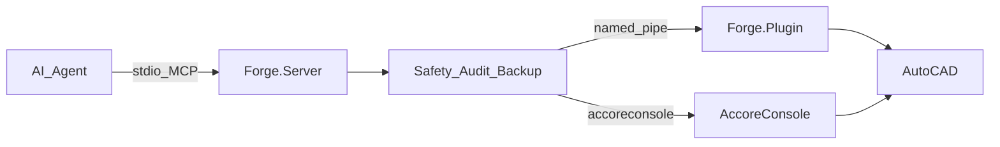

# Architecture

765T-Forge is a dual-process product: an MCP stdio server that agents talk to, and an AutoCAD plugin that executes drawing work. Shared types and the shared safety gate live in `Forge.Shared` (`netstandard2.0`, consumed by both the `net8.0` server and the `net8.0-windows`/`net462` plugin).

## Runtime flow

### Components

| Component | Role |
|-----------|------|
| **AI Agent** | Calls MCP tools (Cursor, Claude Desktop, or other MCP hosts) |
| **Forge.Server** | Stdio MCP server (`ModelContextProtocol`); evaluates the capability gate, writes audit start/completion, routes tools |
| **Named pipe** | JSON line protocol to the in-process plugin (`FORGE_PIPE_NAME`, default `765T.Forge.AutoCAD`); accepts concurrent connections, serializes execution (`plugin_busy`) |
| **AccoreConsole** | Headless path for `forge_run_script` and the shipped multi-DWG `forge_batch_run` queue, resolved from `FORGE_AUTOCAD_ROOT` (or the deprecated `AUTOCAD_2026_ROOT`, else discovery) |
| **Forge.Plugin** | `NETLOAD`ed into AutoCAD; re-checks token + gate; backups; dispatches to ObjectARX/.NET API |
| **AutoCAD** | Source of truth for drawings, plotters, xrefs, and layouts; supported via two plugin components (2017–2024 / 2025–2027) |

### Request lifecycle

1. Agent invokes a tool on `ForgeMcpTools`
2. `ForgeToolRunner` applies the server-side capability gate, audit, and dry-run short-circuit
3. Most tools: `ForgePipeClient` → plugin `NamedPipePluginServer` → main-thread document lock → `PluginCommandProcessor`
4. `forge_run_script` / `forge_batch_run`: server spawns `accoreconsole.exe` instead of the live pipe
5. Plugin re-evaluates the gate, may backup the DWG, executes, returns `ForgeResult` (+ optional verification)

## Safety and audit

Safety is a **trust boundary**, not a convenience filter:

- **Capability gate** — the five free-text executors are `Unsafe` and need `FORGE_ENABLE_UNSAFE_OPS=true` plus per-call `unsafeAcknowledged=true`; no argument text is inspected anywhere
- **Dual evaluation** — server and plugin both run `SafetyPolicy`; AccoreConsole paths are server-only and documented as such
- **Dry-run** — writes can return the planned action without mutating the drawing
- **Backup** — pre-write DWG copy when metadata requires it (`FORGE_BACKUP_DIR`)
- **Audit** — JSONL records on both sides (`FORGE_AUDIT_DIR`), one file per provenance (`server-{yyyyMMdd}.jsonl` / `plugin-{yyyyMMdd}.jsonl`), correlated by `AuditId`, with exact-name secret redaction

If a call times out, assume the write may have committed; read back before retrying. See [safety.md](safety.md) and [SECURITY.md](../SECURITY.md).

## Product shape (Waves 1–3, shipped)

The Waves 1–3 publish stack has landed and sits on the plugin/CAD side of the same transport core:

- **Readiness gate** — `forge_qa_preflight` plus standards-pack and issue-set contract findings can block publish
- **Real DSD publisher** — `forge_plot_publish` drives `Publisher.PublishDsd`, verifies the output, and falls back to per-layout plot when the seat produces no DSD output (marked **partial** until dual-seat evidence)
- **Structured QA** — `QaReport`, dual-source titleblock compare, xref dependency closure, plot-environment fingerprint, modal trap
- **AccoreConsole orchestration** — `forge_run_script` plus the shipped `forge_batch_run` queue with `resumeBatchId` and `forge_batch_status`
- **Recipes and packing** — `forge_recipe_issue_set` (step-by-step, stops at first failure) and `forge_pack_and_go` (plan → resolve → stage → move)
- **Attestation layer** — ceremony/CDE tools report caller-claimed flags and optional AuditId evidence; they are **attested**, not enforced (ADR 0004)

Gates and DSD work stay on the plugin/CAD side of the pipe; the Phase 0 transport diagram above is unchanged.
