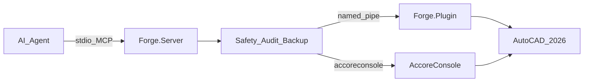

# Architecture

765T-Forge is a dual-process product: an MCP stdio server that agents talk to, and an AutoCAD 2026 plugin that executes drawing work. Shared types and safety policy live in `Forge.Shared`.

## Runtime flow

### Components

| Component | Role |
|-----------|------|
| **AI Agent** | Calls MCP tools (Cursor, Claude Desktop, or other MCP hosts) |
| **Forge.Server** | Stdio MCP server (`ModelContextProtocol`); evaluates safety, writes audit start/completion, routes tools |
| **Named pipe** | JSON line protocol to the in-process plugin (`FORGE_PIPE_NAME`, default `765T.Forge.AutoCAD`) |
| **AccoreConsole** | Headless path for `forge_run_script` (and future multi-DWG job queue) via `AUTOCAD_2026_ROOT` |
| **Forge.Plugin** | `NETLOAD`ed into AutoCAD; re-checks token + safety; backups; dispatches to ObjectARX/.NET API |
| **AutoCAD 2026** | Source of truth for drawings, plotters, xrefs, and layouts |

### Request lifecycle

1. Agent invokes a tool on `ForgeMcpTools`
2. `ForgeToolRunner` applies server-side `SafetyPolicy`, audit, and dry-run short-circuit
3. Most tools: `ForgePipeClient` → plugin `NamedPipePluginServer` → main-thread document lock → `PluginCommandProcessor`
4. `forge_run_script`: server spawns `accoreconsole.exe` instead of the live pipe
5. Plugin re-evaluates safety, may backup the DWG, executes, returns `ForgeResult` (+ optional verification)

## Safety and audit

Safety is a **trust boundary**, not a convenience filter:

- **Denylist** on open-world executor text (destructive AutoCAD patterns, broad `ALL`/`*`)
- **Dual evaluation** — server and plugin both run `SafetyPolicy`
- **Dry-run** — writes can return the planned action without mutating the drawing
- **Backup** — pre-write DWG copy when metadata requires it (`FORGE_BACKUP_DIR`)
- **Audit** — JSONL records on both sides (`FORGE_AUDIT_DIR`), correlated by `AuditId`
- **Unsafe gate** — `forge_exec_dotnet` needs env enablement **and** per-call acknowledgement

If a call times out, assume the write may have committed; read back before retrying. See [safety.md](safety.md) and [SECURITY.md](../SECURITY.md).

## Target product shape (Waves 1–3)

After Wave 1–3, publish flows add a readiness gate, real DSD publisher, structured `QaReport`, and optional AccoreConsole batch/recipe orchestration. The Phase 0 diagram above remains the transport core; gates and DSD sit on the plugin/CAD side of the pipe.
