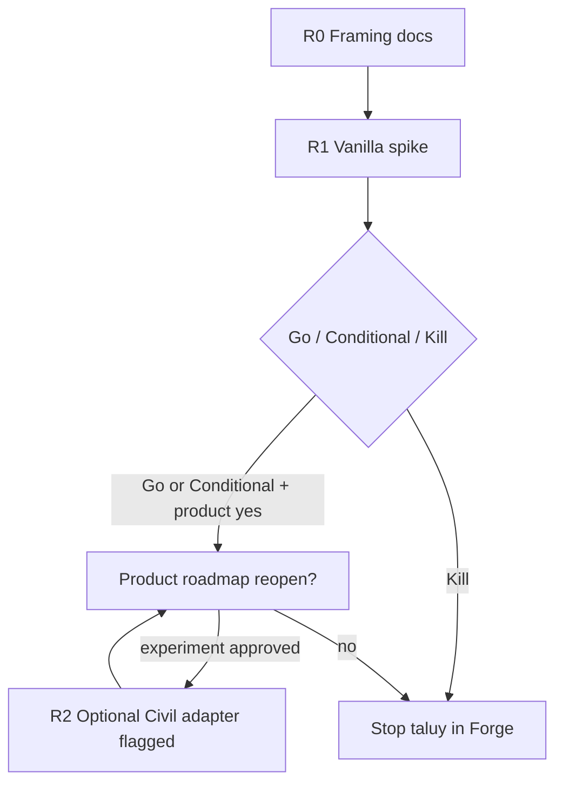

# Civil 3D vs Vanilla AutoCAD for Taluy

> **Status:** R&D decision record — **not** a product scope change.  
> **Product SoT:** Civil 3D and geometry megakit remain **explicitly out of scope** ([capability-matrix.md](../../capability-matrix.md), [roadmap.md](../../roadmap.md)).  
> **Companion:** [00-charter.md](00-charter.md) (phases R0–R2, kill criteria).  
> **Target host for R0–R1:** full AutoCAD 2026 (vanilla 3D), **not** Civil 3D.

---

## 1. Question

For **rải taluy** (cut/fill slope generation along baselines / platform edges) driven by agents through 765T-Forge, should the research path depend on **Civil 3D** grading/feature lines/corridors, or on **vanilla AutoCAD** meshes/solids/polylines?

---

## 2. Option A — Civil 3D path

### What it would use

| Civil concept | Role in taluy |
|---------------|---------------|
| **Alignment + profile** | Horizontal/vertical control (often overkill for short platform edges) |
| **Feature line** | Baseline with elevations; grading fan-out |
| **Grading / grading criteria** | Slope-to-surface or slope-to-elevation daylight |
| **Corridor + assembly** | Repeating cross-sections along an alignment (road/rail box) |
| **TIN surface** | Existing ground (EG) and finished ground (FG) for true catch |
| **Civil .NET API** | `Autodesk.Civil.DatabaseServices.*` et al. — only when Civil is loaded |

### Pros

- Domain-native: cut/fill, daylight to surface, criteria sets, corridor targets match civil engineering practice.
- Associativity: change baseline/criteria → rebuild grading/corridor (when the model is healthy).
- Quantity and section workflows already exist in Civil (volumes, sample lines) — valuable later, not R1.
- SME familiarity: metro earthworks teams often already think in Civil terms.

### Cons

- **Licensing:** Civil 3D seat required on every automation host; metro plot/QA seats today are often full AutoCAD, not Civil.
- **Product conflict:** Forge GA explicitly excludes Civil; shipping Civil tools would reopen matrix/roadmap.
- **API availability:** Civil API assemblies resolve only when Civil is installed and the process is a Civil host (or compatible). Plugin code that hard-references Civil fails to load on vanilla AutoCAD.
- **Automation fragility:** corridor/grading rebuilds, locked objects, proxy/AEC objects, longer command modes, modal UI — higher agent failure surface than typed entity creates.
- **Determinism:** Civil rebuild order, style-dependent tessellation, and surface build options can yield non-bit-stable meshes across seats/versions.
- **Test matrix:** doubles lab cost (vanilla + Civil versions, service packs).
- **Pipe/safety model:** still need dual SafetyPolicy, dry-run, backup — Civil ops are heavy writes; dry-run is harder to fake without a full calc engine.

### Agent automation risk (Civil)

| Risk | Severity | Notes |
|------|----------|-------|
| Assembly load failure on non-Civil seat | **High** | Hard dependency breaks plugin NETLOAD |
| Long rebuild / silent partial rebuild | **High** | Timeouts; write-may-have-committed ambiguity |
| Interactive grading UI / selection prompts | **High** | Agents need fully silent API paths only |
| Proxy graphics when DWG opened without Civil | **Med** | Downstream plot/QA seats may not round-trip well |
| Version skew (Civil API vs AutoCAD year) | **Med** | Bind spike to one year (2026) if ever attempted |
| Over-powered corridor for simple platform taluy | **Med** | Wrong abstraction → brittle parameters |

---

## 3. Option B — Vanilla AutoCAD 3D path

### What it would use

| Vanilla primitive | Role in taluy |
|-------------------|---------------|
| **Polyline3d / Polyline** (fit points with Z) | Baseline and catch lines |
| **Region / Face / SubDMesh / PolygonMesh** | Slope faces / skinned mesh |
| **Solid3d** (loft, extrude, sweep, boolean) | Coordination solids, optional massing |
| **Spline** (optional) | Smoothed crown/toe if needed |
| **Layer + XData/FNV or app dictionary** | Semantics without Civil style system |
| **ObjectARX / Autodesk.AutoCAD.DatabaseServices** | Always available on full AutoCAD 2026 |

Detail catalog: [01-autocad-primitives.md](01-autocad-primitives.md).

### Pros

- **Aligns with product host:** full AutoCAD 2026 is already Forge’s SoT; no new SKU.
- **Load-safe plugin:** no Civil assemblies; NETLOAD identical to current Forge.Plugin.
- **Agent-friendlier writes:** create entities under document lock; easier dry-run (“would create N faces on layers …”).
- **Determinism:** pure geometry from params is controllable (ε, tessellation policy owned by us).
- **Plot/QA chain:** outputs are ordinary DWG entities — existing xref/plot/pack paths keep working.
- **Scope honesty:** research can stay under `docs/research/taluy/` without pretending Civil GA.

### Cons

- **No native EG surface engine:** true daylight-to-TIN needs sampling we must define (grid, triangles we import, or plane-only MVP).
- **Non-associative by default:** param change = delete/regenerate (or custom reactor — out of R1).
- **No corridor targeting / assembly catalog:** multi-bench slopes, ditches, berms are manual rules.
- **Quantities:** mesh volume ≠ certified earthwork; SME must accept coordination-grade only.
- **Curved baselines:** must densify arcs ourselves; chord error is our problem.
- **SME expectation gap:** “not real Civil grading” may limit acceptance for bid packages.

### Agent automation risk (vanilla)

| Risk | Severity | Notes |
|------|----------|-------|
| Incorrect slope side / cut-fill flip | **High** | Mitigate with explicit side + Z tests + dry-run preview |
| Solid loft failures on nasty baselines | **Med** | Fallback to mesh faces; document failure codes |
| Entity spam / layer pollution | **Med** | Strict layer plan + backup + group/handle return |
| ε drift across floating ops | **Med** | Fixed tolerance policy in domain model |
| Over-reliance on `forge_exec_dotnet` | **High** if misused | Long-term path must be typed `forge_taluy_*` |

---

## 4. Licensing & API availability

```text
                    ┌─────────────────────────┐
                    │  Forge.Plugin NETLOAD   │
                    └───────────┬─────────────┘
                                │
              ┌─────────────────┴─────────────────┐
              ▼                                   ▼
   Vanilla AutoCAD 2026 host            Civil 3D 2026 host
   Autodesk.AutoCAD.* OK               Autodesk.AutoCAD.* OK
   Autodesk.Civil.* MISSING            Autodesk.Civil.* OK
   Taluy vanilla path OK               Vanilla path OK
   Civil adapter MUST NOT load         Civil adapter MAY load
```

| Concern | Vanilla | Civil |
|---------|---------|-------|
| Seat SKU | Full AutoCAD (Forge default) | Civil 3D (extra) |
| Runtime reference | `AcDb` / ACCMGD etc. | + `AeccDbMgd` / Civil assemblies |
| Plugin ship strategy | Single plugin binary | **Optional** adapter assembly or reflection/late-bind; **never** hard-link into core plugin default build |
| Capability advertisement | Always listable as research/optional | Advertise only if host probe says Civil present **and** flag enabled |
| DWG consumers without Civil | Native entities | Risk of proxies / missing graders |

**Decision implication:** core Forge.Plugin remains Civil-free. Any future Civil adapter is a **separate** component and **separate** feature flag (see §5).

---

## 5. Decision

| Phase | Stack | Civil? |
|-------|-------|--------|
| **R0** Framing (docs) | Research markdown only | Compare only |
| **R1** Geometry + agent-shaped spike | **Vanilla AutoCAD 2026** (no Civil 3D objects) | **Forbidden** as dependency |
| **R2** Optional adapter | Vanilla remains default | **Optional** Civil adapter behind **separate** flag |
| Product GA | Unchanged until explicit roadmap reopen | Still **out of scope** unless product rewrites matrix |

### R2 flag sketch (not implemented)

If product ever approves an experiment:

- Env example: `FORGE_ENABLE_CIVIL_TALUY=false` (default deny).
- Capability probe: host has Civil + flag + maybe tool profile `civil_research`.
- Tools: distinct names e.g. `forge_taluy_civil_*` or same group with `engine=civil` rejected unless flag — prefer **distinct names** to keep SafetyPolicy metadata obvious.
- Packaging: optional assembly `Forge.Plugin.Civil` **not** loaded unless probe passes.
- Matrix language: `planned/research` only — never “implemented” without smoke + honesty review.

### Why vanilla wins R0–R1

1. Matches current Forge host and exclusion list.  
2. Lowest agent/load risk for a 4-week spike.  
3. Forces a clear MVP: plane daylight + H:V extrusion — enough to learn metro coordination value.  
4. Keeps kill/go about **geometry value**, not seat procurement.

---

## 6. Kill criteria (vanilla cannot meet metro accuracy)

If vanilla fails these, **do not** silently slide into Civil-as-default. Record **Kill** or **Conditional** per [00-charter.md](00-charter.md); Civil only via explicit R2 product decision.

| ID | Trigger | Default threshold (lab; SME may tighten) | Action |
|----|---------|------------------------------------------|--------|
| **K1** | Systematic catch/slope error vs SME reference | > **50 mm** plan or > **100 mm** Z on pilots ≤ 50 m | Kill coordination claim; stop R1 commit design |
| **K2** | Only valuable use case needs real EG TIN daylight | Cannot specify sampling without owning a surface engine | Kill or Conditional “plane-only envelopes”; R2 discussion optional |
| **K3** | Edit loop unusable | SME rejects regenerate-from-params; demands associative grading | Conditional/Kill; Civil R2 only if product funds seats |
| **K4** | Performance | Baseline ≤ 500 verts, preview > **5 s** after algorithmic fixes | Fix or Kill interactive agent path |
| **K5** | Safety model breach | No commit design fits dual-eval / backup / audit | Kill integration path |
| **K6** | Seat blockage | No full AutoCAD 2026 lab | Blocked (ops), not geometry Kill |

**Accuracy note:** thresholds are **coordination-grade**, not survey stakeout or bill-of-earthworks. Crossing K1 means vanilla is not good enough even for that lower bar.

---

## 7. Phase gates (summary)



| Gate | Requires | Pass means |
|------|----------|------------|
| **G1** (end R0) | Charter, domain vocab, this decision | Team builds vanilla only |
| **G2** (mid R1) | Plane daylight + mesh/solid on fixtures | Geometry credible |
| **G3** (late R1) | `forge_taluy_*` sketch + safety class | Agent path credible |
| **G4** (end R1) | SME + metrics M1–M6 | Go / Conditional / Kill |
| **G-R2** | G4 ≠ Kill **and** product flag approval | Civil adapter research only |

---

## 8. Recommendation (binding for research)

1. **Implement and evaluate taluy R&D on vanilla AutoCAD 3D primitives only through R1.**  
2. **Do not** take compile- or load-time Civil dependencies in any default plugin path.  
3. **Treat Civil** as a possible **R2 optional adapter** with separate flag, separate probe, separate tools — never as the MVP engine.  
4. **Apply kill criteria K1–K5** honestly; prefer Kill over shipping a misleading Civil-shaped promise inside research language.  
5. **Leave product matrix/roadmap untouched** until a post-G4 product decision.

---

## 9. References

- [00-charter.md](00-charter.md) — mission, squad, sprint, DoD  
- [01-autocad-primitives.md](01-autocad-primitives.md) — vanilla entities  
- [02-domain-model.md](02-domain-model.md) — baseline / slope / daylight schemas  
- [03-forge-extension.md](03-forge-extension.md) — tool triad / safety  
- [05-api-mvp.md](05-api-mvp.md) — planned API MVP  
- [capability-matrix.md](../../capability-matrix.md) — Civil out of scope  
- [roadmap.md](../../roadmap.md) — do not build Civil / geometry megakit  
- [architecture.md](../../architecture.md) — server → pipe → plugin  
- [safety.md](../../safety.md) — dual eval, dry-run, backup, audit  

---

## 10. Revision

| Rev | Date | Notes |
|-----|------|-------|
| 0.1 | 2026-07-29 | Initial decision: R0–R1 vanilla; R2 optional Civil behind flag |
